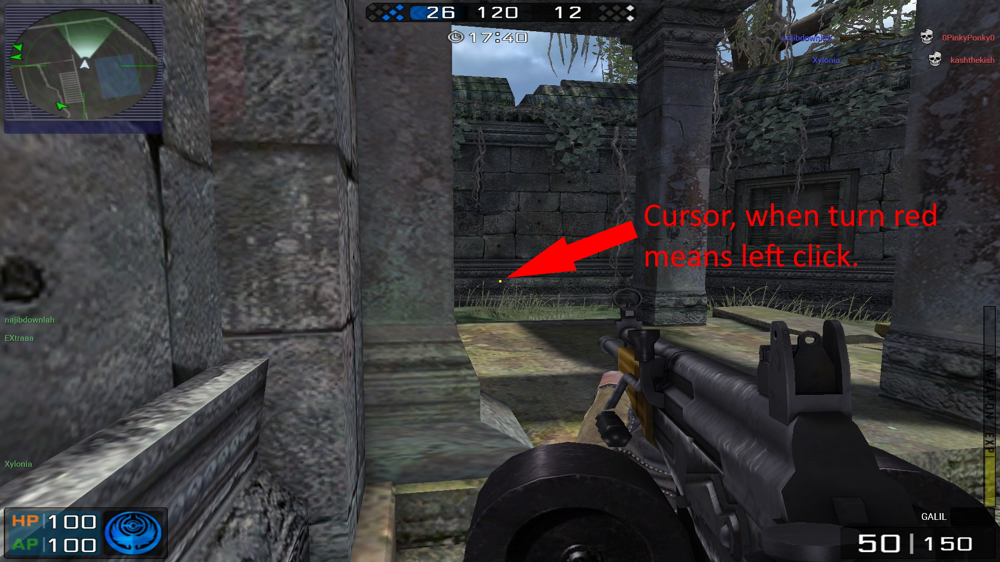

# BS-TriggerBot
 C# form color based trigger bot. Shoot when cursor is red.

Code with: Visual Studio 2019 with C# Windows Forms App (.NET Framework) + AutoItX3Lib.dll 

Autoit Download Website (Using "C:\Program Files (x86)\AutoIt3\AutoItX\AutoItX3.dll"): https://www.autoitscript.com/site/autoit/downloads/

### How to open the main code file: 
1) C:\Users\name\Desktop\BS-TriggerBot\BlackShotTriggerBot\BlackShotTriggerBot.sin (Double click open with VS 2019)
2) Once open, on the VS 2019 right side > Solution Explorer > BlackShotHack > Form1.cs (Double click) > A windows form will be opened (double click on the window form) > Then the code will be shown.

### The Hotkey to turn on/off is set as: "x".

 Yeah Baby Yeah

